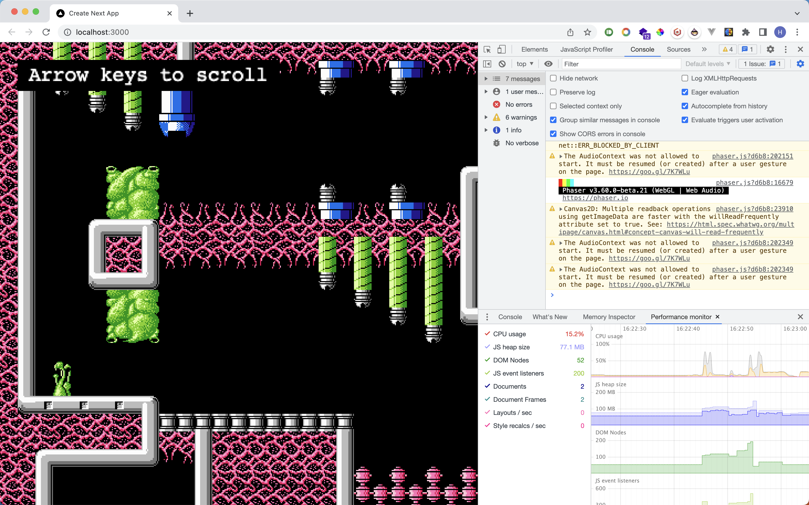
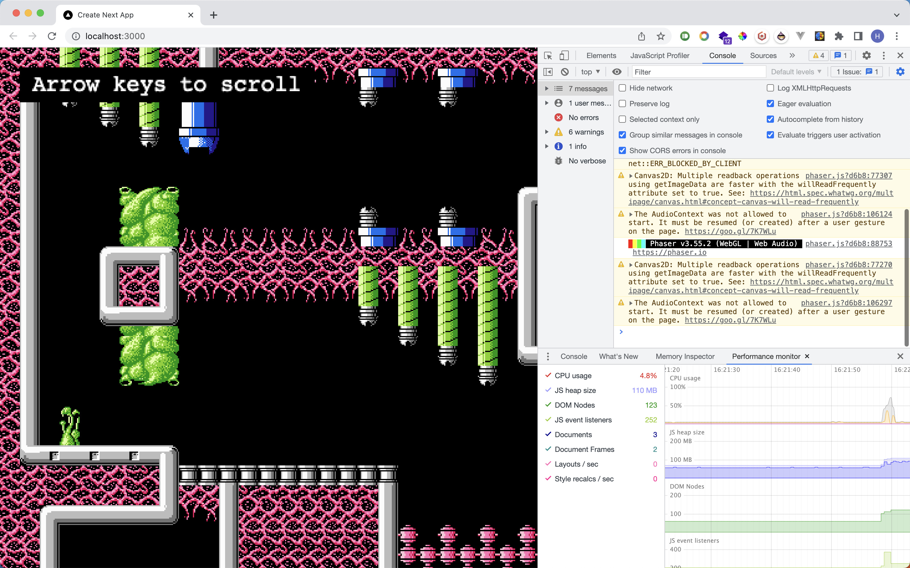

This is a [Next.js](https://nextjs.org/) project bootstrapped with [`create-next-app`](https://github.com/vercel/next.js/tree/canary/packages/create-next-app).

## Getting Started

First, install all packages
```bash
 yarn
```

then, run the development server:

Then
```bash
# or
yarn dev
# or
npm run dev
# or
pnpm dev
```

 Open [http://localhost:3000](http://localhost:3000) with Chrome, and go to Inspector -> Performance monitor  notice that cpu cost is around 15-17%( MBP 2023 16G )




Switch to different branch(3.55.2)
and reinstall the packages again , and run the server
```bash
 yarn
 yarn dev
```
Monit the Performance monitor tab, and the cpu cost is around 5% - 8%




I have no idea why this is happening. I have tested two different versions using React (Vite+React) and cannot distinguish much difference in performance. However, when I use Next.js, it occurs. Is this a problem with Next.js? Did I miss any core concept of Next.js?"


